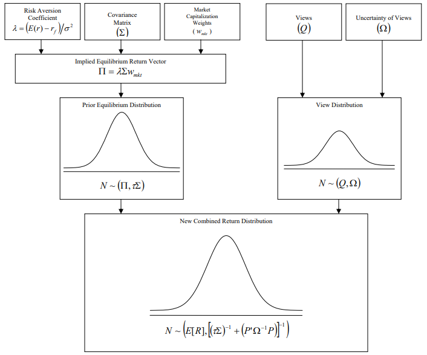

# BLP



Source: Idzorek, T. M. (2004, July 20). A STEP-BY-STEP GUIDE TO THE BLACK-LITTERMAN MODEL.

## A portfolio optimizer based on the Black-Litterman model

(Note: "returns" always refers to returns in excess of the risk-free rate)

The Black-Litterman model takes prior return data for a collection of asset classes, and a manager's views on future returns in those asset classes, and estimates the future distribution of returns. This can be used to determine the optimal weights for a portfolio in those asset classes.

BLP.py provides the Model class to implement the B-L model and determine the optimal weights in a collection of asset classes to maximize the Sharpe ratio of the portfolio.

In example_script.py, we use return data from example_returndata.csv to define three models, with the same asset classes and prior weights but different parameters, and print the model information and computed optimal weights to example_output.csv.

## To install

You will need [Python 3](https://www.python.org/downloads/) with [pip](https://pip.pypa.io/en/stable/installing/).

1. Clone this github repo OR download and unzip this repo
2. Go the downloaded project directory and run: ```pip install -r .\requirements.txt```
3. To test, run: ```python example_script.py```
4. You should see a new file: new_example_output.csv
5. Verify that new_example_output.csv matches example_output.csv


## Model inputs and results

#### Parameters to define a Model:
1. A list of asset classes
2. A list of prior weights in the asset classes
3. The covariance matrix of the excess returns of the asset classes
4. A scalar risk aversion parameter
5. tau: a scalar parameter that weights the covariance matrix
6. tauv: a scalar parameter that weights the manager's views
7. P: a numpy matrix expressing the types of the manager's views. See 'Example parameters' below for an explanation. P should have dimensions KxN, where K is the number of views and N is the number of asset classes
8. Q: a numpy matrix expressing the quantities of the manager's views. See 'Example parameters' below for an explanation. Q should have dimensions Kx1, where K is the number of views
9. An optional identifier, which can be a string or a scalar

#### Example parameters:
For the first model in example_script.py, we use:
```python
model_one = BLP.Model.fromPriorData(
    assetClasses=['US Equity', 'Foreign EQ', 'Emerging EQ'], 
    assetWeights=[0.5, 0.4, 0.1], 
    riskAversion=3, 
    covMatrix=covMatrix,
    tau=0.1,
    tauv=0.1, 
    P=np.asarray(
      [[1,0,0], 
       [0,1,-1]]
       ),
    Q=np.asarray(
      [[0.015],
       [0.03]]
       ),
    identifier=1
)
```
(the covariance matrix is a pandas DataFrame with values `[[0.001846, 0.001599, 0.002031], [0.001599, 0.002438, 0.002393], [0.002031, 0.002393, 0.004383]]`)

P and Q express the views. Each row of P and Q represents a view about the performance of the asset classes in the near future. Views can be absolute or relative.

For example, the first rows of P and Q are `[1,0,0]` and `[0.015]`. This corresponds to the view that "US Equity (the first column) will earn 1.5% excess returns". This is an absolute view - it pertains to the absolute performance of one asset class.

The second rows of P and Q are `[0,1,-1]` and `[0.03]`. This corresponds to the view that "Foreign EQ (the second column) will outperform Emerging EQ (the third column) by 3%". This is a relative view - it pertains to the relative performance of two asset classes.

#### Model results

To access the optimal portfolio, use Model.optimalPortfolio:
```python
print(model.optimalPortfolio)
{
    'weights': [0.6264713805169178, 0.7083398924977391, -0.33481127301465685],
    'returns': 0.0072094451581498666, 
    'sd': 0.044395302498840196, 
    'sharpe': 0.16239207196162725
}
```

To access the expected returns and covariance matrix of the estimated distribution of excess returns, use Model.posteriorDistribution():
```python
estReturns, estCov = model.posteriorDistribution()
print(estReturns)
[0.00617828 0.00746541 0.00582155]
print(estCov)
[[0.00193794 0.00167853 0.00213255]
 [0.00167853 0.00260806 0.00256085]
 [0.00213255 0.00256085 0.00465072]]
```

To access a pandas DataFrame containing all information about the parameters and results of the model, use Model.df:
```python
print(model.df)
                                           0           1            2         3       4         5
Model Identifier                           1         NaN         None       NaN    None       NaN
Prior weights                            0.5         0.4          0.1       NaN    None       NaN
Parameters                     Risk aversion           3          Tau  0.100000    Tauv  0.100000
P                                  US Equity  Foreign EQ  Emerging EQ       NaN     NaN       NaN
View 0                                     1           0            0       NaN     NaN       NaN
View 1                                     0           1           -1       NaN     NaN       NaN
Q                                        NaN         NaN          NaN       NaN     NaN       NaN
View 0                                 0.015         NaN          NaN       NaN     NaN       NaN
View 1                                  0.03         NaN          NaN       NaN     NaN       NaN
Posterior expected returns        0.00617828  0.00746541   0.00582155       NaN     NaN       NaN
Posterior covariance matrix        US Equity  Foreign EQ  Emerging EQ       NaN     NaN       NaN
US Equity                         0.00193794  0.00167853   0.00213255       NaN     NaN       NaN
Foreign EQ                        0.00167853  0.00260806   0.00256085       NaN     NaN       NaN
Emerging EQ                       0.00213255  0.00256085   0.00465072       NaN     NaN       NaN
Optimal weights                     0.626471     0.70834    -0.334811       NaN    None       NaN
Optimal portfolio metrics    Expected return  0.00720945           Sd  0.044395  Sharpe  0.162392
```
